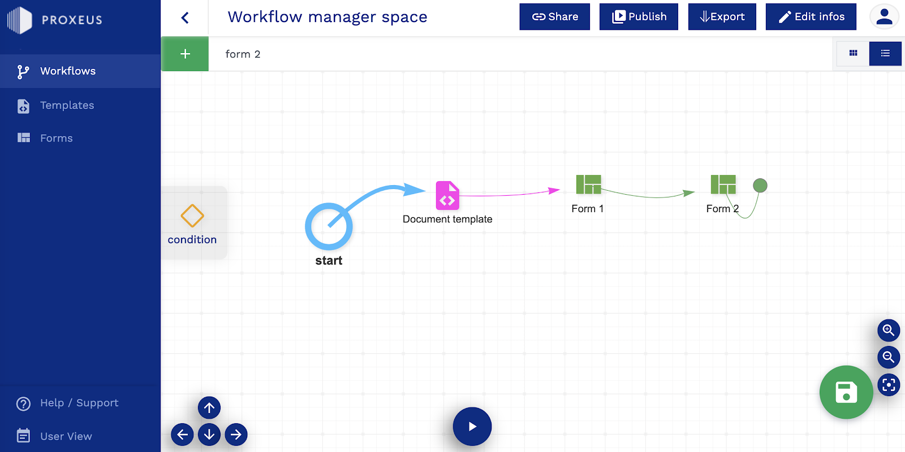
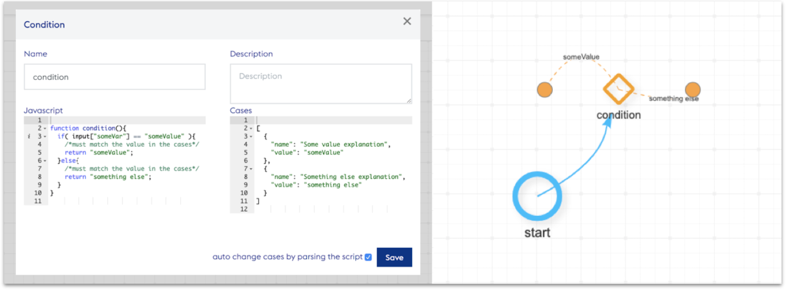
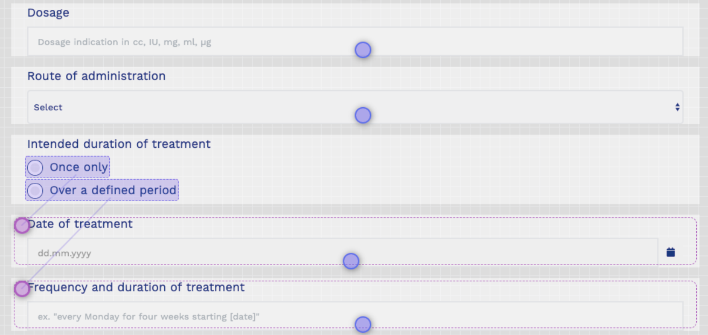

# Key Features

Proxeus Workflows
=================

In past articles we explored Proxeus forms, smart templates and the document service. Proxeus workflows is where all elements come together — let’s take a look how they constitute the backbone of every Proxeus application by defining the process logic and connecting to various actions and input sources.

### What is a Proxeus workflow?

A Proxeus workflow is a series of sequential steps that are carried out based on user-defined rules or conditions in order to execute a business process. Workflows enable Proxeus users to [digitize their know-how](https://medium.com/proxeus/proxeus-wrap-your-know-how-digitally-a99150875ffe) and to make it available to third parties, for free or for a fee paid in XES.

### Creating and editing workflow

The workflow manager offers an interface to assemble and update workflows by combining [forms](https://medium.com/proxeus/gather-structured-information-using-proxeus-forms-e08abcf103aa) and [smart templates](https://medium.com/proxeus/using-proxeus-smart-templates-957eefb75315). Components are added to the workspace via drag & drop and can then be dynamically linked in a sequential flow. Data sources or external services are integrated through the addition of connectors. The resulting workflow can be given various access rights and made available to third parties in the front-end.

### Workflow logic

“Conditions” may be added as graphical elements in the workflow to enable the creation of dynamic decision engines that make the logic, steering and scope of the data collection process dependent on values entered by the end users during the workflow execution process. They can be created easily using IF-functions of JavaScript. Examples are available in the Proxeus [handbook](https://docs.google.com/document/d/1C3B1oNY6lOv8Q_AvbKhwlySrS6qTiRl3raPLV6OXr7w/preview#heading=h.t8n5j48zabtn).

‍

_Example of a simple condition element: script (left) and workflow view (right)_

### Process finalization

Following the completion of all steps, workflows are finalized by calling the [document service](https://medium.com/proxeus/proxeus-document-service-document-templating-made-easy-5304b4ead44e). It then generates the final document(s) by combining the data collected via forms and connectors during the workflow execution together with the variables from document templates that have been included into the workflow. As a final step of every workflow execution, the human readable workflow output (.pdf) is hashed and the hash registered on the Registry Smart Contract (which has been set up by the operator as part of the initial platform deployment, alongside a record of the Ethereum identity of the end user as the issuer of the document). The validation of the corresponding transaction also gives the possibility to add a public reference in order to make the documents registered more easily identifiable.

### Custom connectors and nodes

_Representation of custom connectors in the workflow workspace_

“Custom Connectors” are workflow nodes that extend the possibilities offered out of the box by connecting to external services in order to retrieve data from a designated source or to execute predefined operations (such as sending an email notification). Custom connectors and nodes will be the subject of a separate post detailing the different possibilities they offer to augment the Proxeus experience.

### Machine-readable output

The machine-readable workflow output — a JSON containing the values collected for the variables specified in the workflow — is stored on the platform database and can be accessed via the I/O layer. In addition to manual inputs from end users during the workflow execution, forms can be populated via API calls to external services using the I/O layer. Combined with the possibility to trigger workflows based on the occurrence of certain events, this functionality enables workflow creators to build a fully automated document production service for their use case.

### Interoperability

The workflows can be exported locally and are operable on any Proxeus platform, ensuring that workflow creators and their intellectual property (expressed as workflows, forms and templates) are not dependent on a specific Proxeus platform.

Are you working on interesting use cases pushing the limits of what the framework offers? Are you wondering whether Proxeus can be used to implement your idea? Share your progress with us and get in touch with our dev team, we are always grateful for feedback and happy to support!

‍

Proxeus Forms
=============

December 17, 2019

This week we take a closer look at Proxeus forms which collect data from human users or from Blockchain events and make this information available to create any type of document.

### What are Proxeus forms?

Proxeus forms enable workflows to collect information from users (humans and machines). Each form allows to structure one segment of the data acquisition. Let’s say for example that you would like to create a [company incorporation workflow](https://medium.com/proxeus/proxeus-helps-speeding-up-swiss-business-incorporations-dd0eed421576): the first step will be to ask users for a series of details (domicile, company name, number of shares, members of the board, etc.). This information will then be exported in a machine-readable format and applied to a series of [smart templates](https://medium.com/proxeus/using-proxeus-smart-templates-957eefb75315) in order to produce a human-readable output that can eventually be reviewed and [signed](https://medium.com/proxeus/building-dapps-signature-integration-f2c7f5912595) by the various parties at stake.

### How are forms created?

The Forms workspace is accessible via the backend view of the Proxeus platform. There, the form generator offers an interface to create, duplicate and update forms, as well as to manage the access rights for the forms you own. A large set of components is available by default, including items such as text fields, radio buttons, check boxes and drop-downs.

Those standard components can be dragged from right to left and arranged freely on the form. A click on a component opens a section on the right where attributes can be selected. On top of the mandatory specifications, users can add a number of optional elements, such as help texts or conditions for validating the data that is inputted.

### Custom components

While the broad range of standard components can be used by anyone without specific programming skills, Creators with knowledge of JavaScript, HTML, and JSON have the flexibility to customize existing components or create new ones from scratch. This feature enables advanced users to create custom fields tailored to their needs, such as adding a special phone number field that validates inputs against the Canadian phone number format, or checking if the input is a valid Ethereum address or an existing Twitter handle.

Once created, forms can be accessed and assembled from the workflow manager. They can be shared with multiple workflows and therefore be used in different contexts. This means that the time you spend setting up advanced data collection tools (for example creating a custom drop-down list to reflect your company inventory) is an investment that you can benefit from in different contexts because the components will be updated across all of your workflows every time they are modified.

### Conditional formatting

An important feature allowing you to streamline the data acquisition flow is the possibility to add elements that will be displayed to the user only if certain conditions are met. If you create a [collectible car certificate](https://medium.com/proxeus/blockchain-enables-investing-in-classic-cars-for-everybody-not-just-millionaires-5e9dec740aee), you will for example want to ask for different information depending on the brand or model selected in the first place. This can be done easily via the “Action” tab, where those dependencies can be programmed visually.

### One last check

Select the “Test” tab and you will see the form as it will be presented to the endusers on the platform. This comes quite handy to briefly test your logic without requiring to actually publish and test the workflow.

What interesting application did you implement using Proxeus forms? Share your experience and let us know how we can support you!

‍