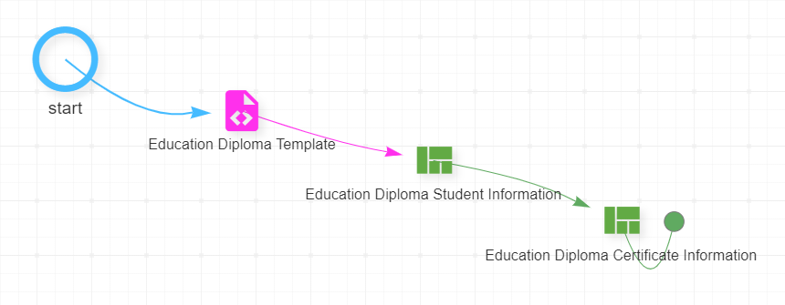
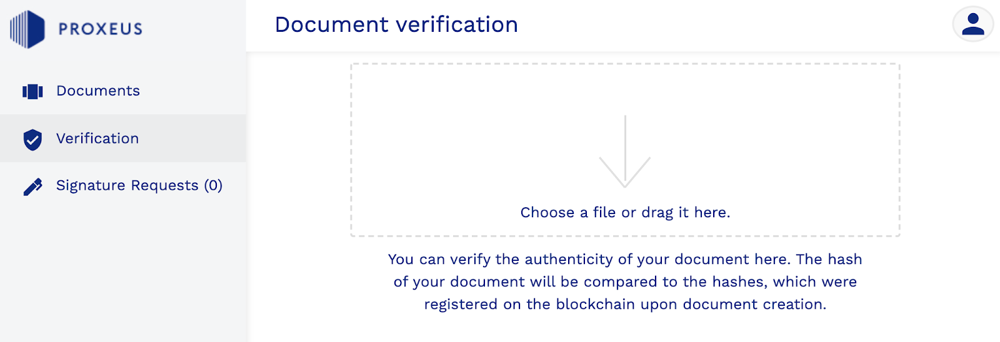
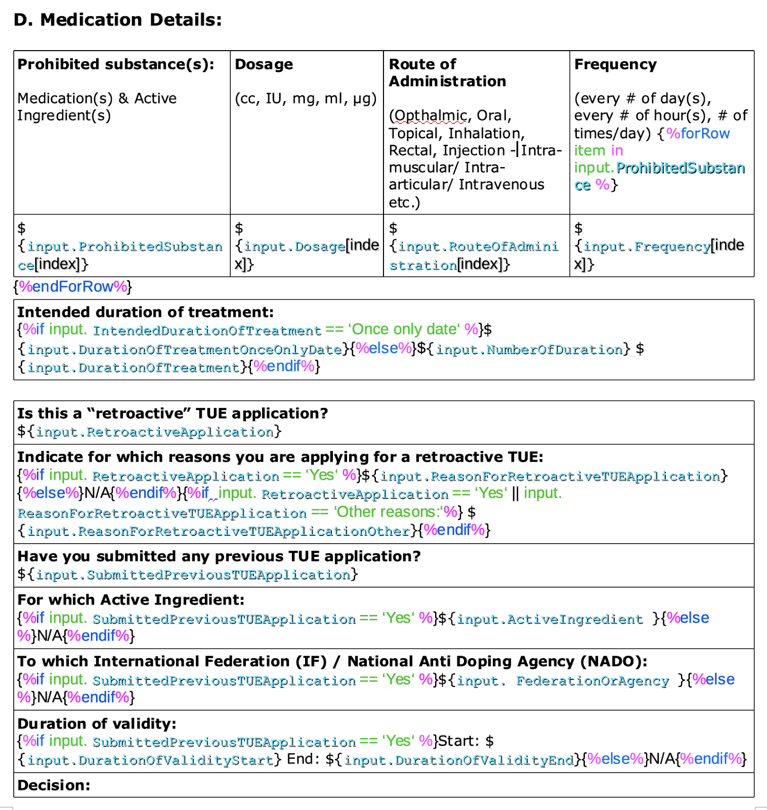
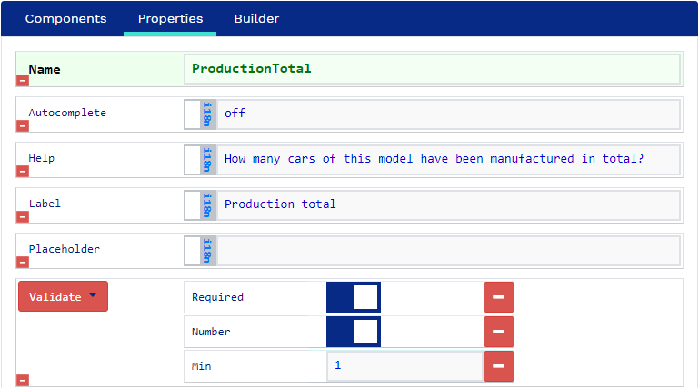
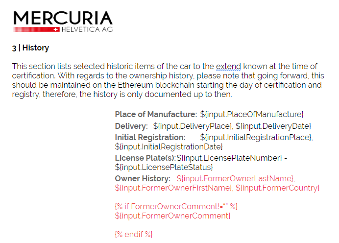
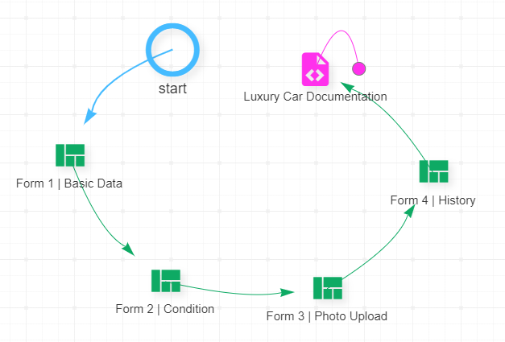

# Use Cases

Proxeus plays the role of a bridge connecting two worlds, allowing you to digitize traditional processes and register information on a blockchain, as well as to make blockchain activity visible by generating human-readable documents.

Legal : Incorporation of Swiss companies
========================================


## Background

The process of legally registering a new company in Switzerland heavily relies on printed documents that have to be exchanged between several parties, and can take up to six weeks. Correctly filling out documents and sending right ones to the right parties in the right order alone can cost weeks to people unfamiliar with the process.

The gathering and exchange of information between the participants is very time consuming and error-prone. The main document can be 30 pages long and every detail needs to be thoroughly verified by a notary before the documentation is handed over to the official business registry. As there are

## Use case exploration

As part of a challenge by [digitalswitzerland](https://digitalswitzerland.com/), Proxeus joined a project initiated in 2017 by IBM, E&Y and Swisscom, aiming to change the status quo and accelerate the registration of Swiss companies. The project team consisted of lawyers, notaries, banks, authorities (register of commerce), IT service providers and software developers.

Following several workshops where the various processes were analyzed, discussed and streamlined. A prototype was built and several improvement loops were done until the point when the group felt confident enough to present the solution publicly. In May 2018, a public demonstration showed that the total time to incorporate a company can be reduced to less than two hours by using the Proxeus document workflow automation engine and a blockchain to coordinate processes more effectively.

## Implementation

The solution consists of a Proxeus platform with workflows for the different legal forms that can be registered, starting with simple forms and adding others later. The workflows comprises a series of smart forms that validate all inputs immediately. This highly simplifies the processes for data entry, document creation and data exchange between all the parties that are involved. Information that had to be entered redundantly up to 30 times is now only entered once in a Proxeus form. Input validation that had to be done manually before, happens automatically now. Tasks that previously had to be tackled sequentially, due to the need to move paper dossiers around, can now be completed in parallel.


Excerpt from one of the user forms of the incorporation process

The workflow also includes a conditional alternative path, depending on if the founder has already opened a capital deposit account at a bank. If he has not, two additional forms are shown and one more document is produced.


Conditional alternative path


At the end of the workflow, all needed documents are created and their hash is registered on the Ethereum blockchain, making the document tamper-proof and verifiable. While Proxeus provides a verification tool for its users’ convenience, the entries are made on the public Ethereum blockchain and may also be checked using block explorers like Etherscan or custom tools.


One of the workflow versions used to incorporate a company

At the end of the workflow, a custom node built for Proxeus’ integration layer interacts with a service developed by the project partner IBM. Through this service, Proxeus is connected to a votation contract on Hyperledger Fabric, allowing the relevant stakeholders (entrepreneur, lawyer, bank, notary, public register) to verify and sign the documents produced. The bank states that the capital money has indeed been paid; the notary confirms that the necessary documents have been provided, read over, and approved; and the commercial register performs a final check that everything is accurate and lawful. After successful collection of all confirmations, the filing is officially registered with the Commercial Register and Official Gazette of Commerce.

## Result

The Proxeus platform set up specially for the business registry project was well-received by all parties. Using the workflows proved intuitive for users of all kinds of professional backgrounds. When the first real business incorporation was done using the platform, it took less than two hours, crushing the initial objective of 48 hours.

<strong> This achievement was a Swiss – and likely world’s – first! </strong>

The prototype worked so well that the test phase has then been prolonged to register up to 100 companies with Proxeus. By now, dozens of companies have been registered through Proxeus workflows and the process has been fine-tuned several times by the project team. In 2020 the platform is still live and being used and maintained by the project participants. The next step for the project, which has already began, is the onboarding of further notaries and lawyers, who will at their turn incorporate companies through Proxeus.


## Feedback

In an [interview](https://medium.com/proxeus/proxeus-helps-speeding-up-swiss-business-incorporations-dd0eed421576) in August 2019, the lawyer Philippe Kaiser from Kaiser Odermatt & Partner, who was involved in the project, commented on the Proxeus solution:

>“The tool highly simplifies the processes for data entry, document creation and data exchange between all the parties that are involved. [...] We can certainly imagine many other use cases. The Proxeus tool is very simple and intuitive to use. In particular, the intuitive handling of the tool opens up many possibilities and easy access for users that aren’t IT experts.”

The project received massive media attention and made it into several big newspapers, magazines and TV shows. It sparked a desire for innovation in several of the cantonal business registers of Switzerland.


## Insights

The project was initially intended as a prototype but was consolidated into a more stable solution as the project participants decided to bring it to MVP level, generating a feedback stream that was useful for improving several aspects of the product. The feedback collected allowed to design and scope a series of sharing features, and led to the improvement of the import/export capabilities of Proxeus, going beyond the requirements set in the original project whitepaper.

The project also led to the realization that a higher degree of automation would require more integration, and that because every participating party has existing IT systems in place, a well-designed integration layer should be made available in order to allow for Proxeus platforms to scale in the future.


## Limitations

The project was initially intended as a prototype but was consolidated into a more stable solution as the project participants decided to bring it to MVP level, generating a feedback stream that was useful for improving several aspects of the product. The feedback collected allowed to design and scope a series of sharing features, and led to the improvement of the import/export capabilities of Proxeus, going beyond the requirements set in the original project whitepaper. 


## Try it yourself

If you enjoyed reading the documentation of this project and would like to try building something similar, we suggest following the steps below. For the most part you’ll only need decent skills in using Proxeus, but for the full scope some programming knowledge is required.

Here is how you can create a workflow - using only Proxeus and no programming at all.

  - Understand the requirements. What workflow output do you expect? What documents should be registered? What role should signatures play?

  - Requirements analysis and specification:

    - Which part of which business process would you like to digitize with your Proxeus prototype?

    - Who are the stakeholders? What are the different tasks? What are the roles?

    - Which documents shall be produced and what information is needed to create them?

    - On which blockchain do you want to register the resulting documents? Do you require a smart contract or would simple transactions suffice?

-   Set up Proxeus. You can run your own instance of Proxeus on a server or locally on your computer. The complete guide to setting up your own instance is available [here](https://doc.proxeus.org/#/README). It is recommended that you deploy your own smart contract following our instructions in the guide and using the template in our [GitHub](https://github.com/ProxeusApp/proxeus-contract.git).

-   Create Proxeus workflows. When you scoped your project in step 1, you figured out which documents need to be produced. After you’ve set up your own instance of Proxeus, you can now configure a workflow for each document. Workflows comprise of data entry forms and document templates. Some users prefer to design the document templates first and then to derive the necessary data inputs in the forms from there. The other way around is also fine.
-   Prepare the document template(s). What should the document design look like? What should placeholders be used for? How should the information be formatted (e.g. what sections should be shown vs. hidden in the final output)?
Excerpt from one of the templates of the incorporation process


<em>Excerpt from one of the templates of the incorporation process</em>

-   Prepare the user forms. Adapt the requirements to the audience (e.g. athletes cannot be expected to be very tech-savvy) - entering the data has to be intuitive and instill confidence. All Proxeus form elements support help texts - they even accept HTML and links to further information - use them to clarify every step.

-   Optimize your workflow for efficient, intuitive data entry. Help the user avoid mistakes by explaining each field with help texts and by validating the fields. Proxeus can support you by checking if the input has the expected format, for example a valid email address or date. Create smart fields that only appear when certain conditions are met. For example, you can use smart placeholders like this:
‍
```
 Number is higher than 0  0 ‍
```


- Interact with blockchains or other systems. Thanks to the integration interfaces of Proxeus, you can simply add custom code into your workflows. Read data from an ERP, send an email confirmation, create a transaction in blockchains other than Proxeus’ native platform Ethereum - all this can be done through custom nodes. The technical documentation of our external nodes library can be found on our GitHub.
  

To help you kickstart your ideas, we’ve provided several examples on this website. In the project for business incorporations we made Proxeus communicate with an API for IBM’s Hyperledger Fabric framework. A votation contract was used to collect the signatures of the participants, each of them confirming that their tasks have been completed. This specific piece of code cannot be shared, but can be recreated using Hyperledger’s documentation - or connecting Proxeus to a voting contract on any blockchain of your choice.

- Set signatures as required - once given by users they are publicly visible on the blockchain and verifiable by anyone.

-  Configure the workflow by connecting the smart template(s) and the forms in a workflow. Set a XES price to the workflow (if applicable) and share the form with the platform users.

-  Test and improve your workflow. Nothing is perfect from the start. Even when your workflow is already in production and in use, you can simply clone it and release an improved version to your users. If the changes are compatible, you can also just upgrade the existing workflow and all running instances will use the new definition automatically.

-  Create an instruction page to onboard users. Our handbook and tutorial videos are also here to help.

-  Integrate a verification tool into your organization’s website to simplify the verification process. The verification tool of your Proxeus platform can be found directly via the /validation path; for example https://morrison.proxeus.org. It can also be embedded using a standard iFrame HTML code.

<iframe width="100%" height="650" src="https://morrison.proxeus.org/" frameborder="0" marginwidth="0" marginheight="0" scrolling="yes"></iframe>

Tamper-proof : University Diplomas
================================


## Background

Suspicion of fraud leads an increasing number of companies to set up verification procedures, creating a backlog of work for education institutions. Blockchain technology makes it possible to issue trusted digital documents that can be verified by employers independently.

## Use case exploration

Over the course of Summer 2018, a discussion was engaged with Professor Dr. Schär, Managing Director of the Center for Innovative Finance at the University of Basel in Switzerland, who presented a basic solution design showing how university diplomas could be certified on the Ethereum blockchain. A project was initiated to prototype his idea within a one-week timeframe using the Proxeus framework.

## Implementation

The project comprised the deployment of a new Proxeus instance, the collection of requirements, the design of a diploma template, the configuration of the diploma creation workflow as well as some fine-tuning and front-end improvements. The team started by creating the template, which allowed to review and validate the required data entry fields based on the university feedback. The diploma looked similar to the following example:


The next step was to create a series of input forms allowing the university staff to enter the relevant student’s information (personal identification data and grade).


  

Once the templates and forms were done, bringing everything in the right order was just a quick drag & drop exercise. The template to be filled comes first, then the data entry forms that guide the user through the process.



A workflow with two forms to fill one template

Finally, a verification interface was built into the Core allowing non-technical users of Proxeus to easily verify the authenticity of documents created using the platform.



## Result

Following a successful first test, Prof. Dr. Schär proposed to go beyond the initial project scope and issue real certificates for his students on the Ethereum mainnet. The university staff was provided with a ready-to-use workflow allowing them to issue course certificates and a few weeks later, all 126 students completing the “Bitcoin, Blockchain and Crypto Assets” course of the University of Basel received certificates registered on the Ethereum mainnet blockchain. This marked the first time that a university in Switzerland secured the authenticity and integrity of an academic certificate on a blockchain, and an important milestone for Proxeus.  
  
The students and everyone with whom they decide to share the certificates can verify the authenticity of the document instantly, 24/7, on a Proxeus verification interface embedded into the university website.  
  
The new verification tool was a direct result of this project and was later used in almost every project. It was also made available for embedding into websites. Check out the step-by-step guide at the end of this article to find out how.  

## Feedback

Prof. Dr. Fabian Schär commented on the project in a university press release:_  
  
“This blockchain solution developed in cooperation with Proxeus greatly improves the process of verifying documents and represents an important step towards forgery-proof academic certificates,” said Prof. Dr. Fabian Schär, Managing Director of the Center for Innovative Finance. “Two tools have been created – one that the university staff can use to create the certificate and register it to the blockchain with its unique hash, and a second, public tool which allows anyone to verify that the electronic document has been issued by the university.”  
  
“Fraudulent documents are a problem in academia just as it is in any field,” he said. “By securing credentials on the Blockchain, we provide an extra layer of security for graduates and potential employers. These credentials can’t be faked, and can be easily verified online. It will introduce a new paradigm of security and offer value to all parties - employers don’t lose time checking credentials, graduates have an edge, and the institutions themselves reduce their reputational risk and a significant administrative burden.”_‍

## Insights

Most university’s requirements received as part of the project could be covered by Proxeus out of the box. Important learnings were made as to how blockchain data can be made accessible to everyone and a visual drag and drop interface was included into the Proxeus Core software. Observations were also made regarding the API integration possibilities with external systems (such as the university ERP) in order to allow for projects to scale. A powerful I/O layer was designed and tested in various further projects in the course of 2019.  
  
Today, the tamper-proof diploma use case can be replicated in under an hour with Proxeus out of the box and it demonstrates what Proxeus intends to facilitate: making the creation of blockchain applications possible in a few clicks and bringing the same level of simplicity as WordPress does for websites.

## Limitations

Proxeus is a workflow engine enabling users to digitize their processes and make document templates available to third-parties decentrally. Its capabilities are therefore focused on the production of new certificates, not on the processing of pre-existing documents, which would require a different solution design. A custom module (out of scope for this project) could be developed to import data directly from a university ERP. One of the key requirements of the university was that the documents would be secured additionally using a so-called "salt". A salt is a unique code increasing the cryptographic difficulty of guessing the contents of a document, as someone in possession of an almost identical document (e.g. only the name and grade change) could theoretically modify those parts and try to reverse-engineer how a hash was made. This feature was too specific to be integrated into the generic Proxeus solution, but can be added manually into the document as invisible (white) text as we have demonstrated.

## Try it out yourself

A very similar version of the workflow developed in this project is available on the [demo platform](https://morrison.proxeus.org/) on Proxeus.com.  

You enjoyed reading the documentation and would like to build a similar workflow? A detailed guide is available [here](https://docs.google.com/document/d/1Gl6R1t0LYRK6kARScx5-vqpiKtd6xqcH2yPPC3wWMr4/preview). All you need is an instance of Proxeus (for example our [demo platform](http://demo.proxeus.com/)) and basic users skills.  

If you are just looking to understand the principles behind the solution, here is a recap of the steps to build it - using only Proxeus and no programming at all.

*   Understanding the requirements. We first discussed what exactly was expected from the workflow, the document certification on the blockchain and the verifiability.
*   Set up Proxeus. You can run your own instance of Proxeus on a server or locally on your computer - or you could use someone else’s instance. The complete guide to setting up your own instance is available [here](http://doc.proxeus.com/#/README). It is recommended that you deploy your own smart contract following our instructions in the guide and using the [template in our GitHub](https://github.com/ProxeusApp/proxeus-contract).
*   Prepare the document template(s). What should the document design look like? What should placeholders be used for? How should the information be formatted? In the use case described above, a user can for example pick a date from the calendar and the template will display the weekday in alphanumeric form (e.g. “Friday”).  
    Here are the direct links to our help materials:  
    \- [General handbook](https://docs.google.com/document/d/1C3B1oNY6lOv8Q_AvbKhwlySrS6qTiRl3raPLV6OXr7w/preview)  
    \- [Template handbook](https://docs.google.com/document/d/1-vJsTrU3w8dEcDr3-nV5owtxqHWSjzEf2uk6m9-cMIs/preview)  
    \- [Education example template](https://docs.google.com/document/d/1Gl6R1t0LYRK6kARScx5-vqpiKtd6xqcH2yPPC3wWMr4/edit)
*   Prepare the user forms. As the university staff will need to use the workflow for each student, data entry has to be efficient and comfortable. We decided to split it into two forms to avoid scrolling: one form for the student’s data and the second for the grade.
*   Configure the workflow by connecting the smart template(s) and the forms in a workflow. Set a XES price to the workflow (if applicable) and share the form with the platform users.
*   Set signatures as required - once given by users they are publicly visible on the blockchain and verifiable by anyone.
*   Test and improve your workflow. Nothing is perfect from the start. Even when your workflow is already in production and in use, you can simply clone it and release an improved version to your users. If the changes are compatible, you can also just upgrade the existing workflow and all running instances will use the new definition automatically.
*   Onboard your users. In the use case described above only a very brief training was required to make sure the university staff would be able to use the platform safely. Our handbook and tutorial videos are always there as an aid in case something is forgotten. Basically, the users only need to know the following steps:  
    \- Log in  
    \- Click “New document” in the “Documents” tab  
    \- Select the workflow you’ve created  
    \- Navigate through the workflow  
    \- Complete the workflow and download the document


_Starting a new workflow to create a blockchain-secured diploma_

9\. Integrate a verification tool into your organization’s website to simplify the verification process. The verification tool of your Proxeus platform can be found directly via the /validation path; for example [https://morrison.proxeus.org/](https://morrison.proxeus.org/). It can also be embedded using a standard iFrame HTML code.  
  
Your iFrame HTML code to embed it into your website would then look like this:

Sports : Anti-doping process
============================


## Background


Professional sport is a matter of national pride and results can have considerable financial consequences. For this reason, this field is highly prone to fraud, which has led to the occurrence of several public scandals over the last years. A series of blockchain use cases can be imagined in this area to increase process efficiency and auditability.  
‍  
The [International Testing Agency](http://ita.sport/) (ITA) was officially founded in January 2018 following a proposal by the International Olympic Committee (IOC) to make anti-doping independent from national and international sports organisations. The organisation has been established by the IOC as an independent, not-for-profit foundation under Swiss law and is headquartered in Lausanne, Switzerland.  
  
One of the key roles of anti-doping organizations is to prevent the materialization of a series of important risks:  
  
\- testing plans (who gets tested when by who) can be leaked  
\- test results can be tampered with  
\- storage servers can be compromised  
\- information shared between parties can be intercepted  
  
ITA is dealing against powerful forces and must therefore constantly look to improve itself and address potential vulnerabilities in its processes. In this context, a project has been discussed and setup to explore the possible applications of blockchain in the anti-doping space.

## Use case exploration


If an athlete has medical reasons to take a prohibited substance, he/she can apply to receive a certificate granting them an exemption for therapeutic use (TUE). Such exemption is given after consideration of an independent medical board and for a set prohibited substance, in a certain dosage, within a limited period.  
‍  
The project consisted of prototyping the digitization of the TUE request workflow (currently managed via a .pdf form sent by the athlete via email) using the [Proxeus](http://www.proxeus.com/) framework, thus increasing process efficiency and auditability.

## Implementation


After the initial project scoping, the project consisted of creating and configuring a workflow based on the existing [TUE request template](https://ita.sport/wp-content/uploads/2019/08/TUE-Form.pdf), designing a corresponding template and setting up a signature process.  

The TUE request was implemented as a multi-page .odt smart template with complex variables:

‍  

## Implementation


An athlete receives a link, fills out the forms and finalizes the process before sharing the finalized document with a doctor (via the address book) and with the medical board of ITA in charge of issuing the final confirmation.  

Finalized TUE documents can be easily verified on a drag and drop interface, which triggers the creation of a new hash. The system checks on the blockchain whether the exact same hash has been registered, allowing to prove whether the document is original or has been tampered with.  

The process was presented on CNN Money Switzerland where Benjamin Cohen, director of ITA, explained the genesis of the organization, its challenges and how blockchain could play a role in the future.  


## Insights


The project was implemented as a prototype through an active exchange with ITA and gave the team an occasion to reflect on the security aspects of the application, as well as to add, test and improve several features, such as the signature requests, the rendering of tables in documents and the possibility to upload custom images as part of a workflow, which can be displayed as attachments in the final document.

## Limitations


The lack of easy access to blockchain applications (e.g. integration of blockchain identity solutions in smartphones) remains an issue for products to be implemented at wide scale. In the present case for example, athletes cannot be expected to perform blockchain transactions independently.

## Try it out yourself


You enjoyed reading the documentation and would like to build a similar workflow? Follow the steps below. All you need is an instance of Proxeus and basic users skills. Check out the handbook and tutorial videos on our website for help.  
  
Here is how you can create a workflow - using only Proxeus and no programming at all.  

*   Understand the requirements. What workflow output do you expect? What documents should be registered? What role should signatures play?
*   Set up Proxeus. You can run your own instance of Proxeus on a server or locally on your computer - or you could use someone else’s instance. The complete guide to setting up your own instance is available [here](http://doc.proxeus.com/#/README). It is recommended that you deploy your own smart contract following our instructions in the guide and using the [template in our GitHub](https://github.com/ProxeusApp/proxeus-contract).  
    
*   Prepare the document template(s). What should the document design look like? What should placeholders be used for? How should the information be formatted (e.g. what sections should be shown vs. hidden in the final output)?  
    
*   Prepare the user forms. Adapt the requirements to the audience (e.g. athletes cannot be expected to be very tech-savvy) - entering the data has to be intuitive and instill confidence. All Proxeus form elements support help texts - they even accept HTML and links to further information - use them to clarify every step.
*   Configure the workflow by connecting the smart template(s) and the forms in a workflow. Set a XES price to the workflow (if applicable) and share the form with the platform users.
*   Set signatures as required - once given by users they are publicly visible on the blockchain and verifiable by anyone.
*   Test and improve your workflow. Nothing is perfect from the start. Even when your workflow is already in production and in use, you can simply clone it and release an improved version to your users. If the changes are compatible, you can also just upgrade the existing workflow and all running instances will use the new definition automatically.
*   Create an instruction page to onboard users. Our handbook and tutorial videos are also here to help.
*   Integrate a verification tool into your organization’s website to simplify the verification process. The verification tool of your Proxeus platform can be found directly via the /validation path; for example [https://morrison.proxeus.org/](https://morrison.proxeus.org/). It can also be embedded using a standard iFrame HTML code.

  
Your iFrame HTML code to embed it into your website would then look like this:

<iframe width="100%" height="650" src="https://morrison.proxeus.org/" frameborder="0" marginwidth="0" marginheight="0" scrolling="yes"></iframe>

Tokenization : Tokenization of Luxury Cars
==========================================
   


## Background


Tokenization of assets is a hot topic and a collaboration was set up in 2018 with Mercuria Helvetica, a startup playing a pioneering role looking at ways to tokenize investment-grade cars, to explore the possible role of the workflow and document automation capabilities of Proxeus in that context.


  

## Use case exploration


The tokenization of an asset means its representation in the digital world through a digital artifact (e.g. using a hash or a token on a blockchain). The creation of multiple tokens each representing a piece of an asset can make this one tradable if the tokens are sold and put onto a marketplace.

While there are several ways and methods to reach this result, we defined and followed the following steps:  

1.  Documentation - define the asset you want to tokenize. Build the documentation you need to describe fully all the aspects of your asset that make it unique, preparing it for registration.
2.  Registration - immutably register your asset. Once your asset is fully documented, register it on the blockchain in order to create a tamper-proof record.
3.  Certification - bring in third-party experts to certify the accuracy and completeness of your documentation, possibly after inspecting the real-world asset. Let them add their cryptographic signatures to your document as evidence for their approval.  
    ‍

If fractional ownership is a topic, the issuer can decide to generate tokens by deploying a smart contract for the asset described in the documentation as an additional step.

## Implementation


The first step was to identify everything that needs to be documented about the luxury cars to be tokenized. Besides the technical attributes of the car (engine type, horse power etc.), we learned that investors will request to know price-defining data such as the production year, rarity (i.e. number of cars produced for a certain model), the history of repairs and maintenance performed, the car’s current condition and so on. The technical description is typically accompanied by a photographic documentation.  

Based on these requirements, the team designed user-friendly data entry forms. The forms were configured to validate the input immediately (e.g. valid date, value within the expected range, all mandatory fields filled etc.)

  


_An excerpt from a user form draft in the form editor_  

‍



_The configuration for an input, validated to be a number and bigger than 0_  

  

As the second step the team designed a smart template that presented the car’s information as well as the uploaded photos in an appealing manner. The template would show or hide sections depending on the information entered in the workflow.



_An excerpt from the document template (draft version)_  

Thirdly, the forms and template were built into a workflow designed to be used by the Mercuria Helvetica’s staff. It allowed for the efficient entry of all relevant data, the rendering of the documentation into a PDF file as well as an effortless registration of the produced documents in a Proxeus smart contract on the Ethereum blockchain.



_A workflow draft that connects four user forms and results in the production of a blockchain-secured documentation of a luxury car_

## Result


The team deployed a new instance of the Proxeus platform and designed the complete workflow to create the documentation dossier. The workflow included the blockchain registration. With this application, Mercuria Helvetica received a standardized and streamlined process to create the documentation for each car to be tokenized. It also provided a tool that enabled anyone to quickly verify the authenticity of all circulating documents.  

Our partner in this project later went on to create Curio Invest, a platform that enables the issuance, distribution and management of fine collectable assets registered as security tokens. CurioInvest makes it possible for collectible assets such as fine automobiles to be registered with the regulators in a compliant way and to be represented as a token that users can acquire.  

## Feedback


In an [interview](https://medium.com/proxeus/blockchain-enables-investing-in-classic-cars-for-everybody-not-just-millionaires-5e9dec740aee) from August 2019, CurioInvest’s CEO Fernando Verboonen made the following statements:  

_“Last year we did a proof of concept using blockchain to register certificates of authenticity and conditions of investment-grade classic and exotic autos. By scanning those certificates and placing the document hash on the blockchain, we were making them verifiable, guaranteeing their originality and authenticity._  

_By having every document involved in the acquisition of a classic car immutably on the blockchain, you are able to scale the process, making it safe, decreasing diligence costs and saving a lot of time: we’re reducing the process from several weeks to seconds!_  

_Our current platform is focusing on the tokenization of the assets and is still quite minimalistic, but in the future we see the opportunity of using Proxeus to create certified documents that can be referenced in the relevant tokenization smart contract. This step will further enhance CurioInvest’s scope and usability by adding features like integrating all the relevant documents of the classic cars.”_

## Insights


The project allowed the product team to understand the possible role of a document-centered workflow engine like Proxeus in the tokenization space, differentiating between the processes that should take place within the application core (document creation, registration, certification) and the ones that are custom to every project and should be set up separately and under the responsibility of the respective projects (smart contract deployment, custody solutions).  

## Limitations


The discussions around the requirements for certifying assets represented critical inputs for designing the Signature Requests feature, which was not available at the time, but now enables certification with Proxeus out of the box.

## Try it out yourself


If you’ve enjoyed reading the documentation of this project and would like to try building something similar, we suggest following the steps below. All you need is an instance of Proxeus and decent users skills. If you haven’t already, you should check out our extensive [handbook](https://docs.google.com/document/d/1C3B1oNY6lOv8Q_AvbKhwlySrS6qTiRl3raPLV6OXr7w/preview) and our [step-by-step guide](https://docs.google.com/document/d/1Gl6R1t0LYRK6kARScx5-vqpiKtd6xqcH2yPPC3wWMr4/preview) for creating a workflow.

‍

1.  Understand the requirements. What workflow output do you expect? What documents should be registered? What role should signatures play?

  

2.  Set up Proxeus. You can run your own instance of Proxeus on a server or locally on your computer - or you could use someone else’s instance. The complete guide to setting up your own instance is available [here](http://doc.proxeus.com/#/README). It is recommended that you deploy your own smart contract following our instructions in the guide and using the [template in our GitHub](https://github.com/ProxeusApp/proxeus-contract).  
      
    
3.  Create the template(s) for the document(s) you want to produce, register and get certified. What are the properties of the asset that need to be described in its documentation? What do the future buyers of the tokens need to know? What are the design requirements?  
      
    
4.  Create the user forms. Now that you’ve designed the desired result, you know what information needs to be collected to fill the templates. Use the data validation capabilities of Proxeus to help the user avoid errors.

  

5.  Configure the workflow by connecting the smart template(s) and the forms in a workflow. Set a XES price to the workflow (if applicable) and share the form with the platform users.

  

6.  Test and improve your workflow. Nothing is perfect from the start. Even when your workflow is already in production and in use, you can simply clone it and release an improved version to your users. If the changes are compatible, you can also just upgrade the existing workflow and all running instances will use the new definition automatically.  
      
    
7.  Create an instruction page to onboard users. Our handbook and tutorial videos are also here to help.

  

8.  Set signatures as required - once given by users they are publicly visible on the blockchain and verifiable by anyone.  
    ‍

‍  

Integrate a verification tool into your organization’s website to simplify the verification process. The verification tool of your Proxeus platform can be found directly via the /validation path; for example [https://morrison.proxeus.org/](https://morrison.proxeus.org/). It can also be embedded using a standard iFrame HTML code. 
  
Your iFrame HTML code to embed it into your website would then look like this:

<iframe width="100%" height="650" src="https://morrison.proxeus.org/" frameborder="0" marginwidth="0" marginheight="0" scrolling="yes"></iframe>


## Take it one step further


Deploy a smart contract!  

After picking an asset, compiling extensive documentation, anchoring it on the blockchain and getting it certified by experts, you may want to deploy a token smart contract for this asset. There is no universal smart contract solution and you should take time to consider different aspects to find the one that fits your needs: how many tokens should be issued? Should they be tradeable? Who will issue them? Should they be burnable? By whom? Should the supply be fixed or should further minting be possible? Is the smart contract controlled by a single private key or do changes require the signature from multiple keys?  

In most jurisdictions, tokens may be considered securities. The consultation of legal experts is necessary if you plan to distribute the tokens created in any way. On the technical side, the deployment of smart contracts entails critical security aspects and this task should be given to specialists, in particular if your tokens are planned to have monetary value (for example by representing a physical asset): smart contract security breaches with partial or total loss of funds have happened frequently in the past and in the famous “DAO hack”, 50 million dollars worth of ETH were lost due to a loophole.  

An example contract template for the registration and certification of documents (“ProxeusFS”) is available in our GitHub repository. For token contract resources, we recommend to look into [OpenZeppelin](https://github.com/OpenZeppelin/openzeppelin-contracts/tree/master/contracts/token/ERC20) open source templates. If you are looking for support, tokenization services are offered by many companies, including [Microsoft Azure](https://azure.microsoft.com/en-us/services/blockchain-tokens/), [Token Factory](https://tokenfactory.global/), [Tokeny](https://tokeny.com/) and [AlphaPoint](https://alphapoint.com/) to name just a few.  

There are lots of free and helpful resources out there. And feel free to reach out to the Proxeus community for help with your endeavors!