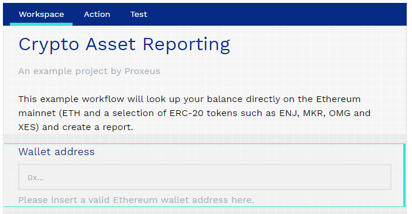
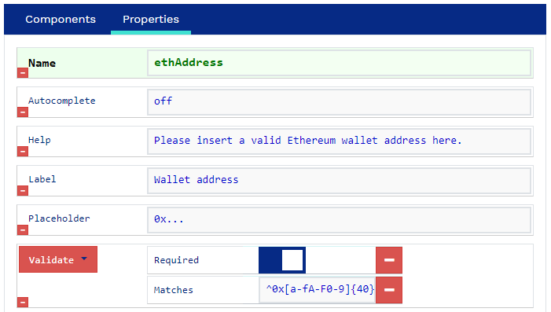
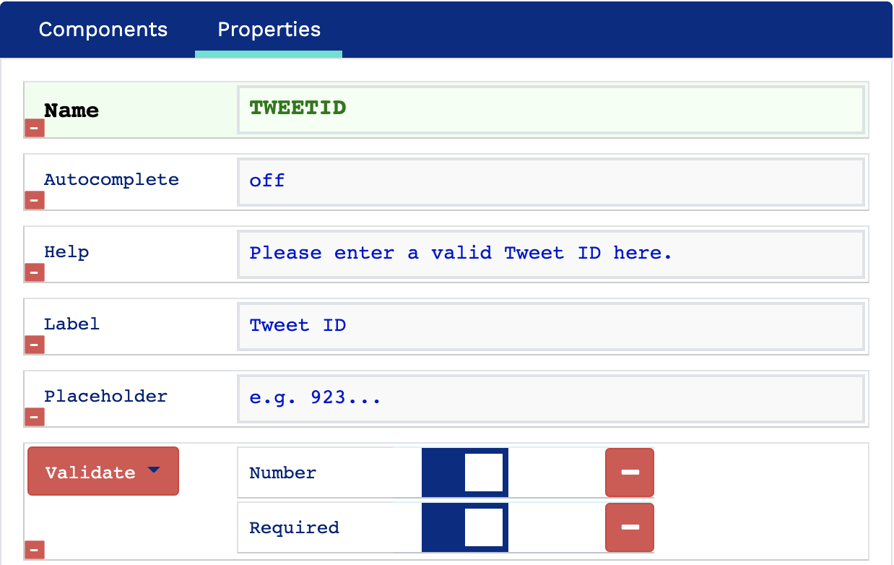

# Application Examples

Proxeus plays the role of a bridge connecting two worlds, allowing you to digitize traditional processes and register information on a blockchain, as well as to make blockchain activity visible by generating human-readable documents.

Crypto Asset Reporting
======================


### Abstract

This practical example shows how you can use Proxeus and its extension capabilities to build a dApp that generates a crypto asset report for any Ethereum wallet. It showcases Proxeus’ ability to access data sources within the Ethereum ecosystem as well as its effectiveness in generating standardized documents.


By creating a simple custom workflow node, enhanced a Proxeus workflow with the capability to access external data. This data is then used in a workflow that can be published and offered to other users for a fee using the XES token.


### The idea
Whereas a bank can provide you with a list of your accounts and assets, most cryptocurrency exchanges and wallets do not offer a comparable service yet. Systematically keeping track is a hassle. When it comes to the yearly tax declaration, token holders have to unlock their wallets, export or even write down all holdings and calculate the end-of-year value of each position. This requires knowhow and manual labor due to the absence of standardized processes and tools. Since the assets are managed on a public ledger and can be accessed fairly easily, it should be possible to automate some steps.


### The solution

All Ethereum-based tokens present on your Ethereum wallets can be queried using existing tools such as Etherscan. Combining this data with the end-of-year valuation of each token produces the list most tax authorities ask for: the name of the asset, the amount held at the end of the year and the value of the position held. It could even be inserted directly into the respective forms of the tax software if an interface is provided.

#### A crypto asset reporting workflow in Proxeus

The workflow should have elements that can do the following things:
‍
1) Ask the user to specify the wallet for which the report shall be created.
2) Retrieve the crypto assets of the selected wallet.
3) Look up the valuation of each asset.
4) Create a PDF report with this information, optionally using a template provided by the user’s tax authority

For steps 1) and 4) we can simply use out-of-the-box functionality of Proxeus. For points 2) and 3) we can implement custom nodes using Proxeus’ external nodes interface. We’ll explain the details a bit further down in this article.


#### About the external nodes interface

The external node interface allows anybody to develop custom-made workflow nodes that can be added without having to modify the Proxeus software. These custom nodes register themselves with the external nodes interface and are then automatically made available for use in workflows by Proxeus Core. Community members can exchange custom nodes simply by making their code or Docker images available. As the nodes can read and write workflow data and are unrestricted in their communication with external systems, they unlock enormous potential and an easy path for extending the core.

The Proxeus Golang library for external nodes is documented in its [Github Repostory](https://github.com/ProxeusApp/node-go.git)

## Check out our demo Workflow

The complete crypto asset report workflow is available on our demo [platform](https://morrison.proxeus.org/). It will be copied to your account automatically when you sign up.

You can start by just running the workflow: User View > Documents > “New document”.

In the admin panel you can analyze how we configured the workflow and as you have your own copy, you are free to make any changes to it.

## How to rebuilt it yourself

If this is your first contact with Proxeus, we recommend you familiarize yourself with the platform first before trying to tackle this example. The “Demo” section on the website provides you with a quick overview.

#### 1) Create a user form

It should inform the user what needs to be done (enter a wallet address) and collect the required input; in this case the wallet address. In our example we used a title element and a simple text input. In the design view on the left it looks like this:



A good form validates user input to prevent user mistakes. With regular expression we can check if the input is a valid Ethereum public address: ^0x[a-fA-F0-9]{40}$

The components configuration on the right side of the form builder will then look as follows:



The name of the input component, ethAddress, is important. It is the variable name to access that input later in the workflow.

#### 2) Retrieve balances

Now we can retrieve the ETH and ERC-20 balances of the input Ethereum address using a custom workflow node. Our example implementation can be found on GitHub: [node-balance-retriever](https://github.com/ProxeusApp/node-balance-retriever.git).

If you wish to build it yourself, we recommend studying the documentation of the [external nodes interface](https://github.com/ProxeusApp/node-go.git). For Golang there is an official implementation of Ethereum: [go-ethereum](https://github.com/ethereum/go-ethereum.git). You could run your own Ethereum node for quick access to the data - or use a service like Infura.

#### 3) Determine asset valuation

After finding out what crypto assets the user holds, the next step is to determine the value of each position. Price aggregators such as CoinMarketCap, Livecoinwatch or CryptoCompare are usually a reliable source of information as they do not rely on a single exchange only. For your example we’ve used the [API of CryptoCompare](https://min-api.cryptocompare.com/).

Our example implementation can be found on GitHub: [node-crypto-forex-rates](https://github.com/ProxeusApp/node-crypto-forex-rates.git)


#### 4) Design a report template

Now you can start designing the template for your report. Create a layout to your liking and add the placeholders to be replaced by the Proxeus document service. The amount of Ether in the wallet, for example, will be available through the variable name “ETH” while its price is “USD_ETH”. You would add it to the template as

```{{input.ETH}} and {{input.USD_ETH}}```

In our example you’ll also have XES, MKR, BAT, USDC, REP and OMG at your disposal.

To display the total value of a position, you’ll have to multiply the two values amount and price:


```{{input.ETH * input.USD_ETH}}.```

The sum of all tokens could be displayed as follows:
The ERC tokens amount to a total of USD 

```{{((input.XES * input.USD_XES)+(input.MKR * input.USD_MKR)+(input.BAT * input.USD_BAT)+(input.USDC * input.USD_USDC)+(input.REP * input.USD_REP)+(input.OMG * input.USD_OMG))}}.```

You can download our example template here.

#### 5) Complete the workflow design

Now all the elements of the workflow are ready and just have to be added to a workflow and put in the right order. The template comes first, followed by the form, which asks the user for the wallet address. Then the first custom node retrieves the balances, for which the second module then fetches the valuation. Lastly the data is inserted into the template and rendered as a PDF.


External nodes can have a configuration UI that can be reached via the workflow editor and a double-click on the node’s symbol. The “Crypto to Fiat Forex Rates” node, one of our examples, has the following UI:


The UI is defined in the node’s code as HTML:


```
const configHTML = `
<!DOCTYPE html>
<html>
<body>
<form action="/node/{{.Id}}/config?auth={{.AuthToken}}" method="post">
Convert to Fiat currency: <input type="text" size="2" name="FiatCurrency" value="{{.FiatCurrency}}">
<input type="submit" value="Submit">
</form>
</body>
</html>
`
```

#### 6) Publish and monetize your workflow (optional)

If you have the knowledge how to compile a good report on crypto assets, this may be valuable to other members of the crypto community. Why not offer it to them for a fee in XES? In the workflow editor, you can set the price. Save, hit “Publish” and start advertising! All fees will automatically be paid to the wallet that you have connected in your user profile on the platform.


## Limitations

1) To ensure that this example can be reproduced with reasonable effort, we have opted for two simplifications.
We retrieve the assets held at the time of execution. This means that the report has to be created at the end of the year or before making trades in the new year. Retrieving the amount held at Dec 31 at midnight would require detailed historical data - not just the block headers - which is possible only through a full archive node of Ethereum. Most users do not have access to such a node as it is usually a premium service by providers like Infura.

    If you have access to a full archive node, you can retrieve the balance as follows using the [Ethereum JavaScript API:](https://github.com/web3/web3.js.git)

```eth.getBalance("<ADDRESS_HERE>", <BLOCK_NUMBER>);```
‍
‍
For ERC-20, you need the token’s contract address (as retrieved in our example) and the contract’s ABI. The ABI is instantiated as follows:

```
var tokenContract = eth.contract([{
"type":"function",
"name":"balanceOf",
"constant":true,
"payable":false,
"Inputs":[{"name":"","type":"address"}],
"outputs":[{"name":"","type":"uint256","value":"0"}] 
}]);‍ 
```


‍
The balance can then be retrieved like this:

```
> var erc20ContractAddress = "<ADDRESS_OF_TOKEN'S_CONTRACT>";
> var account = "YOUR_ADDRESS";
> tokenContract.at(erc20ContractAddress).balanceOf(account);
```

2) We fetch the price of each asset at the time of execution. Ideally the report would perform a lookup on the official list provided by the tax authority. This differs from country to country and can usually be looked up on the website of the tax authority.
We hope you’ve enjoyed this example. If you have any questions, the Proxeus community is always happy to help. When looking for help, please make sure to provide a good description of your problem and what you’re trying to achieve.


Practical Example: Proof of Existence
=====================================


## Abstract

In this practical example we’ll show you how you can use Proxeus to build a dApp for the proof of (prior) existence use case on the blockchain. It showcases Proxeus’ capabilities to interact with external systems as well as with its native blockchain Ethereum.

Using a simple custom node, we enhanced a Proxeus workflow with the capability to access external data. This data is then used in a workflow that you can offer to others for a fee using the XES token.

## The problem

More and more people earn revenue from creating content on online publishing platforms such as Medium and social media platforms such as Twitter, Instagram or LinkedIn. These creators depend on views and engagement for their income, but have few possibilities to defend their intellectual property. If they need to enforce their rights, they carry the burden of proof that their content existed prior to the other publications - and they cannot rely on the platforms for help.

## The solution

Register new content with a trusted and independent source of truth upon publication, including a timestamp providing evidence that the creator was in prior possession of the content before other parties published it. The Ethereum blockchain provides an ideal support for that.

To create this evidence, we need to bring original content into a format that can be registered on the blockchain and made verifiable. The users should be able to easily produce the proof of existence with a simple snapshot every time a new post is made.

For demo purposes, we created a workflow that imports and registers Twitter data. The same solution can be used by analogy to create a proof of prior existence for any type of IP using Proxeus.

#### 1)Building a proof of existence workflow in Proxeus

The workflow should have the following components:

1) Entering the unique identifier (id) of the Tweet you want to register.
   
2) Retrieving the Tweet and its metadata from Twitter.
   
3) Creating a PDF with this information.
   
4) Registering the PDF on the blockchain.
   
Points 1), 3) and 4) can be solved with standard Proxeus functionality. For point 2) we need to build a custom node that takes the content identifier from the workflow data, uses the Twitter API to retrieve the Tweet and then feeds it back into the workflow. As a developer you could have a look at our example custom nodes and figure the rest out yourself - or bear with us as we talk you through the steps with full code examples.

#### 2)About the external nodes interface

The external node interface allows anybody to provide custom-made workflow nodes that can be added without having to modify the Proxeus software. These custom nodes register themselves with the external nodes interface and are then automatically made available for use in workflows by Proxeus Core. Community members can exchange custom nodes simply by making their code or Docker images available. As the nodes can read and write workflow data and are unrestricted in their communication with external systems, they unlock enormous potential and an easy path for extending the core.


## Check out our demo workflow

The complete proof of existence workflow is available on our [demo platform](https://morrison.proxeus.org/). It will be copied to your account automatically when you sign up. 

You can start by just running the workflow (User View > Documents > “New document”). 

In the admin panel you can analyze how we configured the workflow and as you have your own copy, you are free to make any changes to it.

## How to rebuild it yourself

If this is your first contact with Proxeus, we recommend you familiarize yourself with the platform first before trying to tackle this example. The “Demo” section on the website provides you with a quick overview.

### 1) Create a user form
It should inform the user what needs to be done and collect the required input; in this case the unique identifier (id) of the Tweet you want to register. In our example we used a title element and a simple text input. In the design view on the left it looks like this:

A good form validates user input to prevent user mistakes. That is why we added a number validation to the form component.

The components configuration on the right side of the form builder will then look as follows:



The name of the input component, TweetID, is important. It is the variable name to access that input later in the workflow.

### 2) Retrieving a Tweet and its metadata

Now we can retrieve the Tweet and its metadata from Twitter, using a custom workflow node.

If you wish to build it yourself, we recommend studying the documentation of the [external nodes interface](https://github.com/ProxeusApp/node-go.git).

### 3) Design a report template

Now you can start designing the template for your proof of existence. Create a layout to your liking and add the placeholders to be replaced by the Proxeus document service. The Tweet URL, for example, will be available through the variable name “URL” and the Tweet content through “CONTENT”. You would add it to the template as {{input.URL}} and {{input.CONTENT}}. In our example you’ll also have TIMESTAMP, and TWEETID at your disposal.

You can download our example template [here](https://drive.google.com/file/d/1VqaAcYAoZ6L9bgGvWpsk_AT1IapdvmDz/view).

### 4) Complete the workflow design
Now all the elements of the workflow are ready and just have to be added to a workflow and put in the right order. The form comes first and asks the user for the Tweet ID, then the custom node retrieves the Tweet and its metadata. The data is then inserted into the template and rendered as a PDF.


### 5) Publish and monetize your workflow (optional)

Proxeus can serve as a marketplace for workflows. The price setting and the payment procedure are already built in. Now that you’ve created a “proof of existence” workflow for Twitter, why not offer it as a service to popular Twitter accounts? You can charge a fee for every workflow execution, for every secured Tweet!

But why stop here? The same principle can be applied to all other content creation platforms. Create workflows to secure Medium articles or LinkedIn posts! Now that you know how to create a proof of existence workflow, you can use this blockchain-powered use case for any similar business idea.

## Ideas for further development
This example has been kept fairly simple in order to demonstrate the principles and make sure it can be reproduced easily and quickly. Here are some ideas if you would like to go further.

- Using an Ethereum identity provider, you could strengthen your proof by establishing a trusted link between the user’s Ethereum address and real life identity.

- You could change the workflow so that the content is secured BEFORE it is published on the chosen social media platform platform.

- You could fetch and secure the last 5 Tweets instead of just one specific Tweet.

- Instead of asking for the Tweet ID for input, you could ask the users for their login credentials and then automatically retrieve the latest Tweet.

‍__*We hope you’ve enjoyed this example. If you have any questions, the Proxeus community is always happy to help.*__
